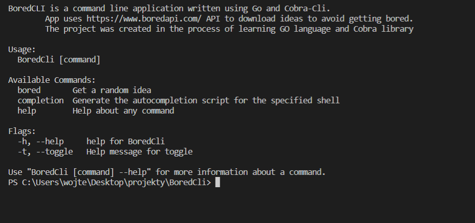

# BoredCli

The application was written while learning Go and Cobra CLI.   
This CLI (Command Line Interface) application allows the user to download a random or customized ideas from Bored API and disply them on the console. 

Link to Bored API website: [Bored Api](https://www.boredapi.com/)

## Table of contents:
* [Technologies](#technologies)
* [Illustrations](#illustrations)

## Technologies
Project is created with:
* Go
* Cobra CLI - Link: [Cobra](https://github.com/spf13/cobra)

## Illustrations

 
 
 
 
 
 
 
 
 
 

